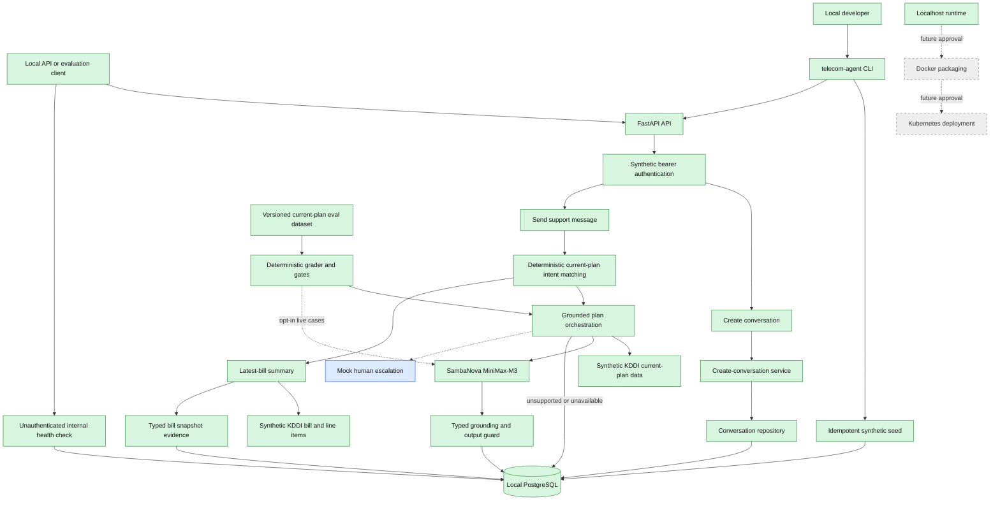

# Architecture

> Architecture follows approved product requirements. Major changes require human approval.

Architecture review status: APPROVED

## 1. Drivers

- KDDI-specific synthetic prototype with private-data boundaries modeled explicitly.
- Grounded account answers, transparent uncertainty, and release-blocking corner-case evaluation.
- English conversational follow-ups and contextual human escalation.
- Privacy, customer isolation, and evaluation evidence over broad feature scope.

## 2. Application and API Shape

Version 0.1 is a localhost-only, API-first backend; no frontend is approved.

```text
POST /v1/conversations
POST /v1/conversations/{conversation_id}/messages
GET  /v1/conversations/{conversation_id}
POST /v1/conversations/{conversation_id}/escalations
GET  /v1/escalations/{escalation_id}
```

Every endpoint requires a synthetic bearer token and customer ownership. Direct public plan, bill,
and charge endpoints are excluded. Exact schemas, errors, status codes, and idempotency are deferred
to the first feature plan.

Approved conversation-creation contract:

- `POST /v1/conversations` requires `Authorization: Bearer <synthetic-token>` and no request body.
- Success returns `201 Created` with `id`, `status: "open"`, and a UTC `created_at` timestamp.
- The response omits customer identity.
- Missing or invalid credentials return `401 Unauthorized`, `WWW-Authenticate: Bearer`, and an
  error envelope with code `unauthorized`.
- Every successful request creates a distinct conversation; idempotency is deferred.
- `open` is the only approved initial conversation status.

Approved grounded current-plan message contract:

- `POST /v1/conversations/{conversation_id}/messages` requires customer ownership and trimmed
  Unicode `content` of 1–2,000 characters.
- Success persists and returns both user and assistant messages with `201 Created`.
- Assistant answers expose `grounded`, `unavailable`, or `unsupported`, an uncertainty flag, and
  typed plan-snapshot evidence when grounded.
- Missing plan data and unsupported questions produce safe persisted exchanges rather than invented
  facts or transport failures.
- Missing and cross-customer conversations share `404 conversation_not_found`; invalid content uses
  stable `422 invalid_message`.

Approved latest-bill message contract:

- The same authenticated message endpoint recognizes direct latest-bill summary requests.
- A grounded response includes the billing period, reconciled total, every ordered line item, and
  one typed `bill_snapshot` evidence reference.
- The first slice uses deterministic wording and does not call MiniMax-M3.
- Missing, empty, invalid-period, negative, or non-reconciling billing data returns a safe persisted
  unavailable exchange without amounts or evidence.
- Unexpected-charge questions remain unsupported until their separately evaluated slice.

## 3. Technology Stack

- Python 3.12+; local environment currently uses Python 3.13.5.
- FastAPI and Pydantic for typed API contracts and OpenAPI.
- Local PostgreSQL.
- Synchronous SQLAlchemy 2, Alembic, and Psycopg.
- `uv` for dependency and lockfile management.
- No frontend, containers, cloud resources, or CI/CD.

## 4. System Context

A local API or evaluation client acts as a synthetic KDDI customer. FastAPI authenticates the mock
identity and calls support services. Services use the domain, local PostgreSQL, a synthetic KDDI
adapter, SambaNova `MiniMax-M3`, and a mock human-escalation adapter.

## 5. Module Boundaries

- `domain`: plans, bills, charges, conversations, escalations, grounding and uncertainty rules.
- `services`: use-case orchestration independent of frameworks and providers.
- `ports`: narrow persistence, customer-data, model, and escalation interfaces.
- `adapters`: PostgreSQL, synthetic KDDI, SambaNova, mock escalation, and deterministic test fakes.
- `api`: FastAPI transport, schemas, mock authentication, and error translation.
- Evaluation suite: datasets and scoring outside production request handling.

## 6. Dependency Direction

```text
api -> services -> domain
adapters -> ports <- services
evaluation -> api/services through public boundaries
```

Domain code must not import FastAPI, PostgreSQL, SambaNova, or concrete adapters. Tests replace
external boundaries, not internal implementation details.

## 7. Persistent Data Model

All approved entities are stored in PostgreSQL. Synthetic KDDI fixtures are the external source;
retrieved plan and bill data are persisted as snapshots. Raw bearer tokens are never stored.

- `SyntheticCustomer`: UUID, display name, synthetic auth subject or token hash.
- `PlanSnapshot`: UUID, customer, plan code/name, allowances, recurring charges, effective and
  retrieval dates, source version, freshness/availability.
- `Bill`: UUID, customer, period, total, currency, retrieval time, source version, freshness/status.
- `BillLineItemSnapshot`: UUID, bill snapshot, stable code, description, decimal amount, and order.
- `Charge`: UUID, bill, description, decimal amount, date, category, supporting details.
- `Conversation`: UUID, customer, status, timestamps.
- `Message`: UUID, conversation, role, Unicode content, UTC timestamp, typed evidence references,
  uncertainty indicator.
- `Escalation`: UUID, customer, conversation, reason, status, timestamps, handoff context.

Core types: UUID identifiers; Python decimal and PostgreSQL `NUMERIC` for money; constrained
three-letter currency (synthetic default `JPY`); dates for calendar values; timezone-aware UTC
timestamps; enums or constraints for statuses and roles; typed evidence references.

Escalation lifecycle:

```text
requested -> queued -> assigned -> resolved
                   \-> failed
```

Cancellation and reopening are deferred.

## 8. External Integrations

### Synthetic KDDI Adapter

Provides deterministic customer, plan, bill, charge, and escalation scenarios. It must simulate
missing, incomplete, conflicting, outdated, and unavailable data. Dynamic KDDI website retrieval is
not approved; public pages cannot provide account-specific data.

### SambaNova Model Adapter

- OpenAI-compatible chat-completions endpoint.
- Initial model: `MiniMax-M3`.
- OpenAI Python SDK with custom base URL and SDK `max_retries=0`.
- Runtime variables: `SAMBANOVA_BASE_URL`, `SAMBANOVA_MODEL`, `SAMBANOVA_API_KEY`.
- 30-second timeout per attempt.
- One adapter-controlled retry for transient timeout, rate-limit, or server failures only.
- No retry for invalid requests or authentication failure; no fallback model.
- Terminal failure returns a safe unavailable response, preserves the message, and allows retry or
  mock escalation.

## 9. Security, Privacy, and Retention

- Synthetic bearer tokens map to mock customer identities; every customer query is scoped.
- One customer cannot access another's conversations, plan, bill, charges, or escalations.
- Only synthetic data is allowed in version 0.1.
- Secrets come from runtime configuration and are never committed or logged.
- Logs and errors exclude tokens and unnecessary customer data.
- Records survive restart and remain until an explicit development reset; startup never resets data.
- Production KDDI identity, consent, encryption, retention, and deletion are deferred.

## 10. Testing and Evaluation

- pytest unit tests for domain, grounding, uncertainty, and escalation rules.
- FastAPI tests for validation, authentication, ownership, and response contracts.
- PostgreSQL integration tests for persistence and escalation transitions.
- Contract tests for KDDI and SambaNova adapter boundaries.
- Deterministic fake model in ordinary tests.
- Separate opt-in SambaNova evaluation suite for routine and corner cases.
- Routine target: at least 80%.
- Mandatory safety groups: 100% safe handling of missing/unavailable and conflicting/outdated data;
  any violation blocks release.

## 11. Runtime and Deployment

FastAPI and PostgreSQL run locally; the API binds to localhost. Remote or public deployment requires
new authentication, security, infrastructure, and operational approval.

## 12. Agreed Feature Flow

Last updated: 2026-08-26 (focused latest-bill summary implemented locally)

The drawing is a living view of agreed architecture. Green nodes are implemented, blue nodes are
approved for version 0.1 but not implemented, and gray nodes are deferred and require later
approval before implementation.



Current implemented request flow:

```text
POST /v1/conversations
  -> synthetic bearer authentication
  -> create-conversation service
  -> SQLAlchemy conversation repository
  -> local PostgreSQL
  -> 201 Created
```

Current local runtime flow:

```text
uv run telecom-agent seed  -> hash token -> local PostgreSQL
uv run telecom-agent serve -> FastAPI on 127.0.0.1:8000
GET /health                -> SELECT 1 -> 200 ok or 503 unavailable
Ctrl-C                     -> graceful API shutdown -> dispose database engine
```

Current grounded plan flow:

```text
POST /v1/conversations/{id}/messages
  -> authenticate customer and verify conversation ownership
  -> classify current-plan intent deterministically
  -> retrieve typed Synthetic KDDI plan facts
  -> create a typed plan snapshot and canonical display facts
  -> MiniMax-M3 generates wording from only the question and canonical facts
  -> reject blank, incomplete, overlong, or extra-numeric output
  -> atomically persist the grounded exchange and evidence
  -> 201 grounded, unavailable, or unsupported exchange
```

Unsupported intent and missing plan data do not call the model. A terminal provider failure or
rejected output persists the user message with a safe unavailable assistant message; rejected raw
output and an unreferenced plan snapshot are not persisted.

Current evaluation flow:

```text
evals/cases/current_plan.jsonl
  -> real current-plan service with evaluation-only data/persistence fakes
  -> offline scenario generator OR opt-in MiniMax-M3 for eligible cases
  -> deterministic status, uncertainty, evidence, required-term, and prohibited-term graders
  -> separate routine >=80% and safety ==100% gates
  -> exit 0 only when both gates pass
```

Current latest-bill flow:

```text
POST /v1/conversations/{id}/messages
  -> authenticate customer and verify conversation ownership
  -> classify a direct latest-bill summary request
  -> retrieve the typed Synthetic KDDI bill and ordered line items
  -> reject missing, empty, invalid-period, negative, or non-reconciling data
  -> deterministically format only the approved billing facts
  -> atomically persist messages, bill snapshot, line items, and typed evidence
  -> 201 grounded or unavailable exchange
```

## 13. Open Architecture Questions

- Exact schemas, errors, status codes, and idempotency for endpoints after message submission.
- Exact tables and constraints for unexpected-charge investigation and escalations.
- Conversation lifecycle beyond creation and escalation.
- Evaluation datasets and scorers beyond current-plan support, including escalation success.
- All production KDDI identity, API, compliance, deployment, and operations concerns.
