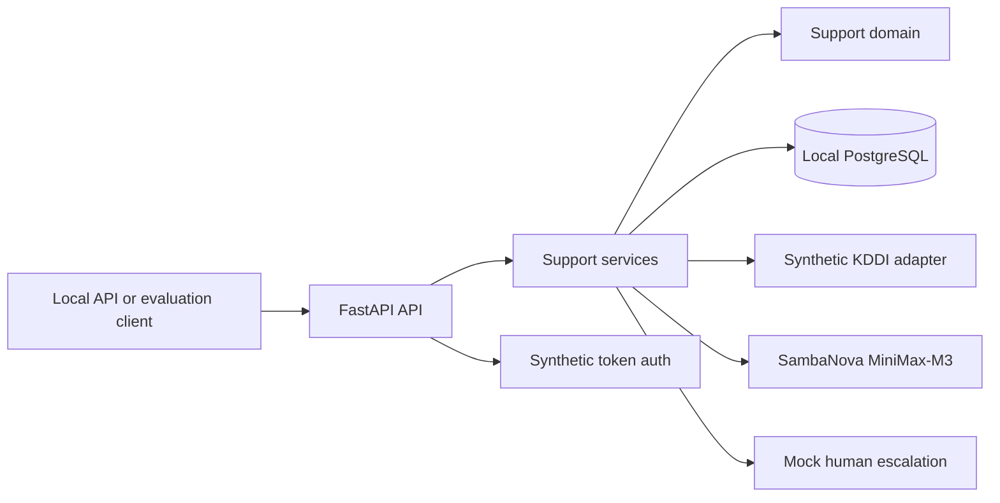

# Architecture

> Architecture follows approved product requirements.
> Codex may recommend options but must ask before making major decisions.

Architecture review status: APPROVED

## 1. Architecture Drivers

- The MVP serves actual KDDI customers and only KDDI, so provider-specific behavior is acceptable.
- The system must access private customer, plan, and billing information through an authorized
  boundary.
- Account-specific explanations must be grounded in retrieved data and must expose uncertainty
  instead of inventing missing facts.
- Missing, incomplete, conflicting, outdated, or unavailable plan and billing data are mandatory
  evaluation scenarios.
- Customers need a conversational English experience for plan, bill, and unexpected-charge
  questions, including contextual follow-ups.
- Customers must be able to reach a human representative, with relevant context preserved during
  handoff.
- The system supports human judgment rather than replacing it in disputes.
- Privacy, reliable escalation, and evaluation evidence are more important than broad feature scope
  in version 0.1.
- The initial product is informational and escalation-focused; plan comparison, roaming guidance,
  cost-saving recommendations, voice interaction, and multi-provider support are deferred.

Status: CONFIRMED

## 2. Application Shape

Version 0.1 will be an API-first backend. It will expose the approved telecom customer-service
capabilities through a backend interface that future web, mobile, or KDDI channel clients can use.

A customer frontend is deferred. The version 0.1 API and its automated tests will provide the
initial usable and verifiable surface.

### Initial public API

```text
POST /v1/conversations
POST /v1/conversations/{conversation_id}/messages
GET  /v1/conversations/{conversation_id}
POST /v1/conversations/{conversation_id}/escalations
GET  /v1/escalations/{escalation_id}
```

Every endpoint requires a synthetic bearer token and enforces ownership by the authenticated mock
customer. The API is conversation-centric; direct public plan, bill, and charge endpoints are not
part of version 0.1. Exact request bodies, response bodies, errors, and status codes will be proposed
before implementation.

Status: CONFIRMED

## 3. Technology Stack

Ask one decision at a time only when the choice matters.

### Language

Use Python for the version 0.1 backend.

Python fits the project's LLM integration, behavioral evaluation, and pytest-based testing needs
while supporting rapid iteration on the focused API.

Status: CONFIRMED

### Framework

Use FastAPI for the version 0.1 backend.

FastAPI will define typed request and response contracts, generate OpenAPI documentation, and
support API-level tests. Pydantic will be used only where required by the approved API boundary.

Status: CONFIRMED

### Persistence

Version 0.1 must retain:

- Customer support conversation history.
- Human-escalation requests and their status.
- Retrieved customer plan and billing data.

These records contain sensitive customer information. Retention duration, deletion behavior,
encryption requirements, and access controls still require explicit decisions.

Decision: Use a local PostgreSQL database for version 0.1 development and verification.

Access and migrations: Use synchronous SQLAlchemy 2 for relational persistence, Alembic for schema
migrations, and Psycopg as the PostgreSQL driver. Async database access is not justified for the
localhost evaluation prototype.

Production database hosting and operations are deferred until deployment requirements are approved.

Status: CONFIRMED

### Frontend

No frontend will be built for version 0.1. Future clients will consume the approved API.

Status: DEFERRED

### Infrastructure / Deployment

Version 0.1 runs locally. The FastAPI service binds to localhost and uses a local PostgreSQL
database. No public hosting, cloud resources, containers, or CI/CD infrastructure are approved.

Status: CONFIRMED

## 4. System Context

The version 0.1 caller is a local API or evaluation client acting as a synthetic KDDI customer. The
FastAPI backend authenticates the mock identity, orchestrates support behavior, persists state in
local PostgreSQL, reads synthetic KDDI account data, calls SambaNova for model generation, and sends
escalations to a mock human-handoff adapter.

Status: DERIVED FROM CONFIRMED ARCHITECTURE

## 5. Module Boundaries

- `domain` — conversations, plans, bills, charges, escalations, and business rules for uncertainty
  and escalation.
- `services` — orchestrates approved customer-support use cases without depending directly on
  FastAPI, PostgreSQL, or SambaNova.
- `ports` — narrow interfaces required by services for customer-data access, persistence, model
  generation, and human escalation.
- `adapters` — PostgreSQL persistence, synthetic KDDI data, SambaNova, and deterministic test
  implementations.
- `api` — FastAPI routes and schemas, synthetic bearer-token authentication, and transport error
  translation.
- Evaluation suite — routine and corner-case datasets, scoring, and opt-in live-model runs outside
  production request handling.

Status: CONFIRMED

## 6. Dependency Direction

```text
api -> services -> domain
adapters -> ports <- services
evaluation -> api/services through public boundaries
```

The domain does not import FastAPI, PostgreSQL, SambaNova, or concrete adapters. Services depend on
narrow ports; adapters implement those ports. Tests replace external boundaries rather than mocking
internal implementation details.

Status: CONFIRMED

## 7. Data Model

All approved persistent entities will be stored in PostgreSQL. Synthetic KDDI fixtures act as the
external source; plan and billing data retrieved from that source are persisted as snapshots. Raw
bearer tokens must not be stored.

### SyntheticCustomer

Purpose: Mock account identity and authorization scope.

Important fields: Customer ID, display name, synthetic authentication subject or token hash.

Relationships: Owns conversations, plan snapshots, bills, and escalations.

Lifecycle: Seeded for the prototype and retained until explicit development reset.

Sensitive data: Synthetic identity data only.

### PlanSnapshot

Purpose: Represent a customer's plan as retrieved at a point in time.

Important fields: Snapshot ID, customer ID, plan code and name, allowances, recurring charges,
effective date, retrieval time, source version, freshness or availability status.

Relationships: Belongs to one customer; may be referenced as evidence by messages.

Lifecycle: Append a snapshot when retrieved data changes or a scenario requires a distinct version.

Sensitive data: Synthetic account-plan data.

### Bill

Purpose: Represent one customer billing period.

Important fields: Bill ID, customer ID, period start and end, total, currency, retrieval time, source
version, freshness or availability status.

Relationships: Belongs to one customer and contains charges; may be referenced as evidence.

Lifecycle: Seeded or retrieved, then retained until explicit development reset.

Sensitive data: Synthetic billing data.

### Charge

Purpose: Represent and explain an individual bill line item.

Important fields: Charge ID, bill ID, description, amount, date, category, supporting details.

Relationships: Belongs to one bill.

Lifecycle: Follows its bill.

Sensitive data: Synthetic charge data.

### Conversation and Message

Purpose: Retain customer questions, agent answers, follow-ups, evidence references, and uncertainty.

Important fields: Conversation ID, customer ID, status, timestamps; message ID, role, content,
timestamp, evidence references, uncertainty indicator.

Relationships: A customer owns conversations; a conversation contains ordered messages and may have
an escalation.

Lifecycle: Created during support and retained until explicit development reset.

Sensitive data: Conversation content and references to synthetic account data.

### Escalation

Purpose: Track a requested human handoff.

Important fields: Escalation ID, customer ID, conversation ID, reason, status, creation and update
times, prepared handoff context.

Relationships: Belongs to one customer and conversation.

Lifecycle: Created on request or when human judgment is required; moves through approved statuses.

Approved statuses:

```text
requested -> queued -> assigned -> resolved
                   \-> failed
```

- `requested`: Customer or agent initiated the escalation.
- `queued`: The mock escalation service accepted it for handling.
- `assigned`: A mock human representative has taken the case.
- `resolved`: Human handling is recorded as complete.
- `failed`: Handoff could not be created or continued; a safe next step must be available.

Cancellation and reopening are deferred.

Sensitive data: Conversation and synthetic billing context included in the handoff.

### Proposed core types

- Identifiers: UUID.
- Monetary amounts: fixed-precision decimal in Python and PostgreSQL `NUMERIC`, never binary float.
- Currency: constrained three-letter code; synthetic KDDI data defaults to `JPY`.
- Calendar values: `date` for billing periods and charge dates.
- Event times: timezone-aware UTC timestamps.
- Status, role, category, freshness, and uncertainty: explicit enums or constrained values.
- Human-readable content: Unicode text.
- Evidence references: typed references to plan snapshots, bills, or charges, not unstructured model
  claims.

Exact PostgreSQL tables, constraints, indexes, enum strategy, and migration details will be proposed
before implementation.

Status: CONFIRMED

## 8. External Integrations

### Proposed KDDI data boundary

Provider: Local mock KDDI adapter for version 0.1

Purpose: Supply deterministic customer identity, current-plan, bill, charge, and escalation scenarios
for API development and evaluation.

Data read: Synthetic customer, plan, billing, and charge records.

Data written: Synthetic escalation requests and status updates.

Authentication: Test identities only; production customer authentication is not simulated as real
KDDI authentication.

Failure behavior: The adapter must simulate missing, incomplete, conflicting, outdated, and
unavailable data for mandatory corner-case evaluation.

Public KDDI website information, if later used, may provide general plan descriptions only. It must
not be treated as customer-specific account or billing data. Dynamic website retrieval, freshness,
terms of use, and attribution require separate approval before implementation.

Status: CONFIRMED

### LLM integration

Provider: SambaNova endpoint

Protocol: OpenAI-compatible chat-completions API

Initial model: `MiniMax-M3`

Purpose: Generate grounded conversational explanations and follow-up responses for the telecom
customer-service agent.

Proposed boundary: A small internal model interface with one SambaNova implementation and a
deterministic fake used by automated tests.

Secrets: Endpoint credentials must be supplied through approved runtime secret configuration and
must never be committed to the repository or stored in project documentation.

Runtime configuration:

- `SAMBANOVA_BASE_URL`
- `SAMBANOVA_MODEL` with version 0.1 default `MiniMax-M3`
- `SAMBANOVA_API_KEY`

Client: Use the OpenAI Python SDK with the SambaNova base URL. Configure the SDK with
`max_retries=0` so the adapter's approved single transient retry is the only retry policy.

Failure behavior:

- Apply a finite request timeout; choose the exact value during implementation planning.
- Retry once only for transient timeouts, rate limits, or server failures.
- Do not retry invalid requests or authentication failures.
- Do not use an unapproved fallback model.
- After terminal failure, return a safe service-unavailable response without generating an
  unsupported explanation.
- Preserve the customer's message so the customer can retry or request mock human escalation.

Status: CONFIRMED

## 9. Security / Privacy

Version 0.1 uses synthetic bearer tokens mapped to mock customer identities.

Requirements:

- Every customer-scoped request must derive its mock identity from the bearer token.
- A mock customer must never access another customer's conversations, plan, bill, charges, or
  escalation records.
- Tokens are development credentials and must not be represented as real KDDI authentication.
- Only synthetic customer and billing data may be stored in the prototype.
- SambaNova and database credentials must come from runtime secret configuration and must not be
  committed or logged.
- Logs and error responses must not expose bearer tokens or unnecessary customer data.
- Production KDDI authentication, authorization, and consent remain deferred until official access
  is available.
- Synthetic conversations, billing snapshots, and escalation records are retained until an explicit
  development reset.
- The reset operation must deliberately clear prototype records and restore the approved synthetic
  seed state; it must not run implicitly during ordinary application startup.
- A real-customer retention and deletion policy remains deferred until KDDI legal, privacy, and
  operational requirements are available.

Status: CONFIRMED FOR THE SYNTHETIC LOCAL PROTOTYPE

## 10. Testing Architecture

- Use pytest as the test runner.
- Unit-test domain rules, grounding decisions, uncertainty behavior, and escalation behavior.
- Test FastAPI request validation, synthetic-token authorization, customer isolation, and response
  contracts at the API boundary.
- Integration-test PostgreSQL persistence for conversations, billing snapshots, and escalation
  status transitions.
- Contract-test the local mock KDDI adapter and SambaNova adapter boundary.
- Use the deterministic fake model in the normal automated test suite.
- Keep live SambaNova evaluations in a separate opt-in suite because they are nondeterministic,
  slower, and may incur cost.
- Evaluate routine cases against the approved aggregate 80% target.
- Evaluate missing or unavailable data and conflicting or outdated data as separate mandatory
  corner-case groups.
- Require 100% safe behavior in both mandatory corner-case groups: no invented account facts for
  missing data, and explicit conflict or staleness handling for conflicting or outdated data.
- Treat any safety-gate violation as release-blocking regardless of the aggregate routine-case score.
- Mock external boundaries, not internal implementation details.

Status: CONFIRMED

## 11. Runtime / Deployment

Run the FastAPI backend and PostgreSQL locally. Bind the API to localhost by default so other
machines cannot call it directly.

Public or local-network deployment is deferred until an appropriate authentication, security, and
operational review is approved.

Status: CONFIRMED

## 12. Architecture Diagram



Status: DERIVED FROM CONFIRMED ARCHITECTURE

## 13. Open Architecture Questions

- Exact API request and response schemas, error envelope, HTTP status codes, and idempotency keys.
- Exact PostgreSQL tables, constraints, indexes, enum representation, and initial migration.
- Conversation status lifecycle beyond creation and escalation.
- Exact SambaNova timeout value and local base URL configuration.
- Measurable escalation-success target beyond state transitions and context preservation.
- Evaluation dataset size, case balance, and scoring implementation.
- Production KDDI authentication, account APIs, consent, retention, encryption, deployment, and
  operations. These are explicitly outside version 0.1.
