# Architecture

> Architecture follows approved product requirements. Major changes require human approval.

Architecture review status: APPROVED

## 1. Drivers

- KDDI-specific synthetic prototype with private-data boundaries modeled explicitly.
- Grounded account answers, transparent uncertainty, and release-blocking corner-case evaluation.
- English conversational follow-ups and contextual human escalation.
- Privacy, customer isolation, and evaluation evidence over broad feature scope.

## 2. Application and API Shape

Version 0.1 is a localhost-only, API-first backend; no frontend is approved.

```text
POST /v1/conversations
POST /v1/conversations/{conversation_id}/messages
GET  /v1/conversations/{conversation_id}
POST /v1/conversations/{conversation_id}/escalations
GET  /v1/escalations/{escalation_id}
```

Every endpoint requires a synthetic bearer token and customer ownership. Direct public plan, bill,
and charge endpoints are excluded. Exact schemas, errors, status codes, and idempotency are deferred
to the first feature plan.

Approved conversation-creation contract:

- `POST /v1/conversations` requires `Authorization: Bearer <synthetic-token>` and no request body.
- Success returns `201 Created` with `id`, `status: "open"`, and a UTC `created_at` timestamp.
- The response omits customer identity.
- Missing or invalid credentials return `401 Unauthorized`, `WWW-Authenticate: Bearer`, and an
  error envelope with code `unauthorized`.
- Every successful request creates a distinct conversation; idempotency is deferred.
- `open` is the only approved initial conversation status.

Approved grounded current-plan message contract:

- `POST /v1/conversations/{conversation_id}/messages` requires customer ownership and trimmed
  Unicode `content` of 1–2,000 characters.
- Success persists and returns both user and assistant messages with `201 Created`.
- Assistant answers expose `grounded`, `unavailable`, or `unsupported`, an uncertainty flag, and
  typed plan-snapshot evidence when grounded.
- Missing plan data and unsupported questions produce safe persisted exchanges rather than invented
  facts or transport failures.
- Missing and cross-customer conversations share `404 conversation_not_found`; invalid content uses
  stable `422 invalid_message`.

Approved latest-bill message contract:

- The same authenticated message endpoint recognizes direct latest-bill summary requests.
- A grounded response includes the billing period, reconciled total, every ordered line item, and
  one typed `bill_snapshot` evidence reference.
- The first slice uses deterministic wording and does not call MiniMax-M3.
- Missing, empty, invalid-period, negative, or non-reconciling billing data returns a safe persisted
  unavailable exchange without amounts or evidence.
- The latest-bill formatter does not infer causes; diagnostic questions route to the separate
  unexpected-charge evidence flow below.

Approved unexpected-charge message contract:

- Diagnostic bill questions identify only the approved `roaming_data` line item in this first
  slice; an ambiguous `this charge` reference asks for a description or amount.
- A grounded explanation requires a reconciled bill plus confirmed charge evidence whose code,
  description, amount, currency, and event date agree with that bill.
- Grounded responses cite both `bill_snapshot` and `charge_snapshot` evidence and state the approved
  event, service activation, and nonjudgmental next step.
- Missing causal evidence returns an uncertain limitation with only bill evidence. Stale or
  conflicting evidence is explicitly flagged and never presented as a current explanation.
- Refunds, adjustments, dispute decisions, and the actual escalation endpoint remain outside this
  slice.

Approved conversation-history contract:

- `GET /v1/conversations/{conversation_id}` requires a synthetic bearer token and customer
  ownership and returns `200 OK` with the conversation metadata and complete message history.
- Messages are ordered by UTC `created_at` and UUID as a deterministic tiebreaker.
- User messages expose their base fields; assistant messages also expose answer status,
  uncertainty, and typed plan, bill, or charge evidence references.
- The response does not embed snapshot bodies. Pagination is deferred for the focused synthetic
  MVP.
- Missing and cross-customer conversations share the privacy-preserving
  `404 conversation_not_found` response.

Approved escalation trigger boundary:

- The agent may recommend human support when judgment or unavailable evidence requires it.
- Only an explicit authenticated customer request may create an escalation; recommendations and
  unsupported requests never create a ticket automatically.
- `POST /v1/conversations/{conversation_id}/escalations` requires JSON `reason`, trimmed to 1–1,000
  Unicode characters. Invalid input returns stable `422 invalid_escalation_reason`.
- Creation first persists `requested`, then synchronously calls the deterministic mock. Acceptance
  transitions to `queued`; rejection or unavailability transitions to `failed` with a safe retry
  next step.
- Both durable outcomes return `201 Created` with ID, conversation ID, reason, status, creation and
  update timestamps, and nullable `next_step`.
- One conversation may have at most one active escalation in `requested`, `queued`, or `assigned`.
  Another creation request returns `409 escalation_already_active`; a `resolved` or `failed`
  escalation permits a new request. PostgreSQL must enforce the active-record invariant.
- Creation freezes an immutable typed handoff context in PostgreSQL `JSONB`: conversation metadata,
  ordered messages, assistant status/uncertainty, and typed evidence references. It excludes raw
  snapshot bodies and credentials, and later messages never alter the submitted context.
- Creation and `GET /v1/escalations/{escalation_id}` expose the same public fields: ID, conversation
  ID, reason, status, creation/update timestamps, and nullable `next_step`. Handoff context remains
  internal. Missing and cross-customer escalation IDs share `404 escalation_not_found`.
- The runtime deterministic mock accepts valid handoffs and transitions them to `queued`. Automated
  tests inject failure to verify durable `failed` behavior; customer content and public settings
  cannot force mock failure. `assigned` and `resolved` do not auto-progress in this slice.

## 3. Technology Stack

- Python 3.12+; local environment currently uses Python 3.13.5.
- FastAPI and Pydantic for typed API contracts and OpenAPI.
- Local PostgreSQL.
- Synchronous SQLAlchemy 2, Alembic, and Psycopg.
- `uv` for dependency and lockfile management.
- No frontend, containers, cloud resources, or CI/CD.

## 4. System Context

A local API or evaluation client acts as a synthetic KDDI customer. FastAPI authenticates the mock
identity and calls support services. Services use the domain, local PostgreSQL, a synthetic KDDI
adapter, SambaNova `MiniMax-M3`, and a mock human-escalation adapter.

## 5. Module Boundaries

- `domain`: plans, bills, charges, conversations, escalations, grounding and uncertainty rules.
- `services`: use-case orchestration independent of frameworks and providers.
- `ports`: narrow persistence, customer-data, model, and escalation interfaces.
- `adapters`: PostgreSQL, synthetic KDDI, SambaNova, mock escalation, and deterministic test fakes.
- `api`: FastAPI transport, schemas, mock authentication, and error translation.
- Evaluation suite: datasets and scoring outside production request handling.

## 6. Dependency Direction

```text
api -> services -> domain
adapters -> ports <- services
evaluation -> api/services through public boundaries
```

Domain code must not import FastAPI, PostgreSQL, SambaNova, or concrete adapters. Tests replace
external boundaries, not internal implementation details.

## 7. Persistent Data Model

All approved entities are stored in PostgreSQL. Synthetic KDDI fixtures are the external source;
retrieved plan and bill data are persisted as snapshots. Raw bearer tokens are never stored.

- `SyntheticCustomer`: UUID, display name, synthetic auth subject or token hash.
- `PlanSnapshot`: UUID, customer, plan code/name, allowances, recurring charges, effective and
  retrieval dates, source version, freshness/availability.
- `Bill`: UUID, customer, period, total, currency, retrieval time, source version, freshness/status.
- `BillLineItemSnapshot`: UUID, bill snapshot, stable code, description, decimal amount, and order.
- `ChargeEvidenceSnapshot`: UUID, customer, line-item identity, amount/currency, event date,
  location, service, trigger, evidence state, retrieval time, and source version.
- `Conversation`: UUID, customer, status, timestamps.
- `Message`: UUID, conversation, role, Unicode content, UTC timestamp, typed evidence references,
  uncertainty indicator.
- `Escalation`: UUID, customer, conversation, reason, status, timestamps, next step, and immutable
  typed JSONB handoff context.

Core types: UUID identifiers; Python decimal and PostgreSQL `NUMERIC` for money; constrained
three-letter currency (synthetic default `JPY`); dates for calendar values; timezone-aware UTC
timestamps; enums or constraints for statuses and roles; typed evidence references.

Escalation lifecycle:

```text
requested -> queued -> assigned -> resolved
                   \-> failed
```

Cancellation and reopening are deferred.

## 8. External Integrations

### Synthetic KDDI Adapter

Provides deterministic customer, plan, bill, charge, and escalation scenarios. It must simulate
missing, incomplete, conflicting, outdated, and unavailable data. Dynamic KDDI website retrieval is
not approved; public pages cannot provide account-specific data.

### SambaNova Model Adapter

- OpenAI-compatible chat-completions endpoint.
- Initial model: `MiniMax-M3`.
- OpenAI Python SDK with custom base URL and SDK `max_retries=0`.
- Runtime variables: `SAMBANOVA_BASE_URL`, `SAMBANOVA_MODEL`, `SAMBANOVA_API_KEY`.
- 30-second timeout per attempt.
- One adapter-controlled retry for transient timeout, rate-limit, or server failures only.
- No retry for invalid requests or authentication failure; no fallback model.
- Terminal failure returns a safe unavailable response, preserves the message, and allows retry or
  mock escalation.

## 9. Security, Privacy, and Retention

- Synthetic bearer tokens map to mock customer identities; every customer query is scoped.
- One customer cannot access another's conversations, plan, bill, charges, or escalations.
- Only synthetic data is allowed in version 0.1.
- Secrets come from runtime configuration and are never committed or logged.
- Logs and errors exclude tokens and unnecessary customer data.
- Records survive restart and remain until an explicit development reset; startup never resets data.
- Production KDDI identity, consent, encryption, retention, and deletion are deferred.

## 10. Testing and Evaluation

- pytest unit tests for domain, grounding, uncertainty, and escalation rules.
- FastAPI tests for validation, authentication, ownership, and response contracts.
- PostgreSQL integration tests for persistence and escalation transitions.
- Contract tests for KDDI and SambaNova adapter boundaries.
- Deterministic fake model in ordinary tests.
- Separate opt-in SambaNova evaluation suite for routine and corner cases.
- Routine target: at least 80%.
- Mandatory safety groups: 100% safe handling of missing/unavailable and conflicting/outdated data;
  any violation blocks release.
- The cross-feature MVP baseline independently gates latest bill, unexpected charge, conversation
  history, and escalation routine cases at 80% each. Its combined safety gate is 100%; any feature
  routine failure or safety failure blocks the overall release gate.
- Its initial balanced dataset contains 36 cases: five routine and four safety cases for each of the
  four features, totaling 20 routine and 16 safety cases.

## 11. Runtime and Deployment

FastAPI and PostgreSQL run locally; the API binds to localhost. Remote or public deployment requires
new authentication, security, infrastructure, and operational approval.

## 12. Agreed Feature Flow

Last updated: 2026-08-29 (factual plan comparison human-verified)

The drawing is a living view of agreed architecture. Green nodes are implemented, blue nodes are
approved for version 0.1 but not implemented, and gray nodes are deferred and require later
approval before implementation.

```mermaid
flowchart TB
    Client[Local API or evaluation client] --> API[FastAPI API]
    API --> Auth[Synthetic bearer authentication]
    Client --> Health[Unauthenticated internal health check]
    Health --> DB

    Developer[Local developer] --> CLI[telecom-agent CLI]
    CLI --> Seed[Idempotent synthetic seed]
    Seed --> DB
    CLI --> API

    Auth --> Create[Create conversation]
    Create --> ConversationService[Create-conversation service]
    ConversationService --> ConversationRepo[Conversation repository]
    ConversationRepo --> DB[(Local PostgreSQL)]

    Auth --> Message[Send support message]
    Message --> Intent[Deterministic plan, bill, and charge intent matching]
    Intent --> Support[Grounded plan orchestration]
    Support --> KDDI[Synthetic KDDI current-plan data]
    Support --> Model[SambaNova MiniMax-M3]
    Model --> Guard[Typed grounding and output guard]
    Guard --> DB
    Support -->|unsupported or unavailable| DB
    Support -.-> Escalation[Mock human escalation]

    Intent --> BillSupport[Latest-bill summary]
    BillSupport --> BillData[Synthetic KDDI bill and line items]
    BillSupport --> BillEvidence[Typed bill snapshot evidence]
    BillEvidence --> DB

    Intent --> ChargeInvestigation[Unexpected-charge investigation]
    ChargeInvestigation --> BillData
    ChargeInvestigation --> ChargeData[Typed synthetic charge event]
    ChargeInvestigation --> ChargeEvidence[Bill and charge evidence]
    ChargeEvidence --> DB
    ChargeInvestigation -. judgment or missing cause .-> Escalation

    Auth --> History[Conversation-history retrieval]
    History --> HistoryRepo[Owned ordered-message read model]
    HistoryRepo --> DB
    History --> Escalation[Create contextual human escalation]
    Escalation --> EscalationService[Escalation service]
    EscalationService --> MockHandoff[Deterministic mock handoff]
    EscalationService --> EscalationRepo[Escalation repository]
    EscalationRepo --> DB
    Auth --> EscalationStatus[Retrieve escalation status]
    EscalationStatus --> EscalationRepo

    Dataset[Versioned current-plan eval dataset] --> Eval[Deterministic grader and gates]
    Eval --> Support
    Eval -. opt-in live cases .-> Model

    MvpDataset[Versioned five-feature 45-case dataset] --> MvpEval[Cross-feature deterministic gates]
    MvpEval --> BillSupport
    MvpEval --> ChargeInvestigation
    MvpEval --> History
    MvpEval --> EscalationService
    MvpEval --> PlanComparison

    Intent -->|comparison intent| PlanComparison[Read-only factual plan comparison]
    PlanComparison --> OfferCatalog[Versioned synthetic KDDI catalog provider]
    Clock[Injected UTC clock] --> PlanComparison
    PlanComparison --> KDDI
    PlanComparison --> EligibilityNotice[Unverified eligibility disclosure]
    PlanComparison --> ComparisonFormatter[Canonical deterministic formatter]
    PlanComparison --> ComparisonEvidence[One typed plan-comparison snapshot reference]
    ComparisonEvidence --> DB
    ComparisonEvidence --> ComparisonOffers[Three ordered comparison-offer rows]
    ComparisonOffers --> DB
    PlanComparison -. invalid, stale, or conflicting facts .-> Escalation

    Local[Localhost runtime] -. future approval .-> Docker[Docker packaging]
    Docker -. future approval .-> K8s[Kubernetes deployment]

    classDef implemented fill:#d7f5df,stroke:#238636,color:#111
    classDef agreed fill:#dbeafe,stroke:#2563eb,color:#111
    classDef deferred fill:#eeeeee,stroke:#777,color:#333,stroke-dasharray:5 5

    class Client,API,Auth,Health,Developer,CLI,Seed,Create,ConversationService,ConversationRepo,Message,Intent,Support,KDDI,Guard,Model,DB,Local implemented
    class Escalation,EscalationService,MockHandoff,EscalationRepo,EscalationStatus implemented
    class History,HistoryRepo implemented
    class ChargeInvestigation,ChargeData,ChargeEvidence implemented
    class BillSupport,BillData,BillEvidence implemented
    class Dataset,Eval implemented
    class MvpDataset,MvpEval implemented
    class PlanComparison,OfferCatalog,Clock,EligibilityNotice,ComparisonFormatter,ComparisonEvidence,ComparisonOffers implemented
    class Docker,K8s deferred
```



Current implemented request flow:

```text
POST /v1/conversations
  -> synthetic bearer authentication
  -> create-conversation service
  -> SQLAlchemy conversation repository
  -> local PostgreSQL
  -> 201 Created
```

Current local runtime flow:

```text
uv run telecom-agent seed  -> hash token -> local PostgreSQL
uv run telecom-agent serve -> FastAPI on 127.0.0.1:8000
GET /health                -> SELECT 1 -> 200 ok or 503 unavailable
Ctrl-C                     -> graceful API shutdown -> dispose database engine
```

Current grounded plan flow:

```text
POST /v1/conversations/{id}/messages
  -> authenticate customer and verify conversation ownership
  -> classify current-plan intent deterministically
  -> retrieve typed Synthetic KDDI plan facts
  -> create a typed plan snapshot and canonical display facts
  -> MiniMax-M3 generates wording from only the question and canonical facts
  -> reject blank, incomplete, overlong, or extra-numeric output
  -> atomically persist the grounded exchange and evidence
  -> 201 grounded, unavailable, or unsupported exchange
```

Unsupported intent and missing plan data do not call the model. A terminal provider failure or
rejected output persists the user message with a safe unavailable assistant message; rejected raw
output and an unreferenced plan snapshot are not persisted.

Current evaluation flow:

```text
evals/cases/current_plan.jsonl
  -> real current-plan service with evaluation-only data/persistence fakes
  -> offline scenario generator OR opt-in MiniMax-M3 for eligible cases
  -> deterministic status, uncertainty, evidence, required-term, and prohibited-term graders
  -> separate routine >=80% and safety ==100% gates
  -> exit 0 only when both gates pass
```

Current cross-feature evaluation flow:

```text
evals/cases/mvp.jsonl (45 versioned cases)
  -> real bill/charge/history/escalation/comparison public service boundaries with deterministic fakes
  -> deterministic observable-outcome graders
  -> five independent routine >=80% gates and one combined safety ==100% gate
  -> exit 0 only when every gate passes; no filters, live mode, database, or model calls
```

The router recognizes the preserved regression language for recent invoices, billing periods or
latest statements, direct roaming charges, and unrecognized roaming usage. Ambiguous `this charge`
requests retain higher-priority clarification routing. The unchanged 36-case gate passes locally;
independent human verification reproduced the pass on 2026-08-27.

Current factual plan-comparison flow:

```text
POST /v1/conversations/{id}/messages
  -> authenticate customer and verify conversation ownership
  -> classify comparison intent before generic current-plan intent
  -> retrieve current-plan facts and the typed three-offer synthetic catalog
  -> reject missing, incomplete, stale, conflicting, mixed-currency, or ineffective input
  -> calculate signed recurring-charge and domestic-data deltas
  -> deterministically format all four plans plus freshness and eligibility disclosures
  -> atomically persist messages, one comparison snapshot, three offers, and typed evidence
  -> 201 grounded or evidence-free unavailable exchange
```

The 45-case gate scores every routine feature 5/5 and safety 20/20. Independent human verification
reproduced the grounded localhost comparison and full evaluation pass on 2026-08-29; PostgreSQL
history reconstruction is additionally covered by the integration suite.

Current latest-bill flow:

```text
POST /v1/conversations/{id}/messages
  -> authenticate customer and verify conversation ownership
  -> classify a direct latest-bill summary request
  -> retrieve the typed Synthetic KDDI bill and ordered line items
  -> reject missing, empty, invalid-period, negative, or non-reconciling data
  -> deterministically format only the approved billing facts
  -> atomically persist messages, bill snapshot, line items, and typed evidence
  -> 201 grounded or unavailable exchange
```

Current unexpected-charge flow:

```text
POST /v1/conversations/{id}/messages
  -> authenticate customer and verify conversation ownership
  -> identify the supported roaming item or request clarification
  -> retrieve and reconcile the latest bill
  -> retrieve typed causal event evidence
  -> compare item identity, amount, currency, event period, and freshness state
  -> deterministically explain only confirmed matching evidence
  -> atomically persist messages, bill snapshot, charge snapshot, and typed links
  -> 201 grounded, unavailable/uncertain, or unsupported exchange
```

Current conversation-history flow:

```text
GET /v1/conversations/{id}
  -> authenticate the synthetic customer
  -> load only a conversation owned by that customer
  -> retrieve all messages ordered by UTC timestamp and UUID
  -> bulk-load and merge plan, bill, and charge evidence references
  -> return metadata and the complete typed message history
  -> 200 history or privacy-preserving 404
```

Current contextual-escalation flow:

```text
POST /v1/conversations/{id}/escalations
  -> authenticate customer and load the complete owned conversation
  -> freeze ordered messages and typed evidence references into immutable JSONB context
  -> persist requested before calling the deterministic mock handoff
  -> transition to queued on acceptance or failed with a safe next step
  -> enforce one active escalation per conversation in PostgreSQL
  -> 201 durable escalation or stable 404/409/422 error

GET /v1/escalations/{id}
  -> authenticate and retrieve only an escalation owned by that customer
  -> return minimal public status fields without internal handoff context
  -> 200 escalation or privacy-preserving 404
```

## 13. Open Architecture Questions

- Conversation lifecycle beyond creation and escalation.
- Evaluation datasets and scorers beyond current-plan support, including escalation success.
- All production KDDI identity, API, compliance, deployment, and operations concerns.
